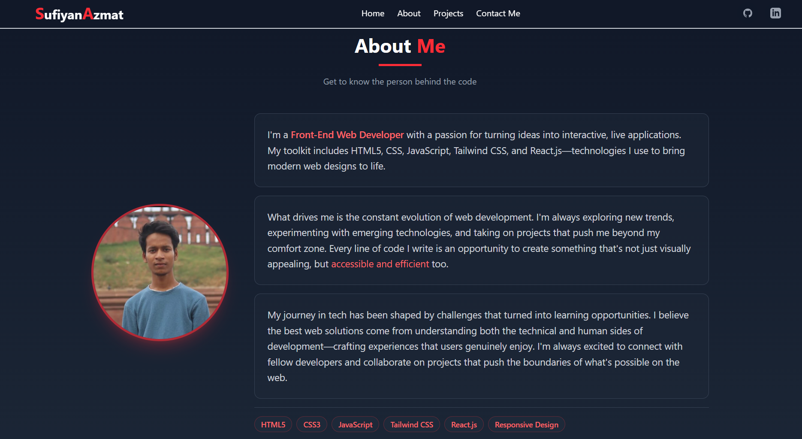

# 👨‍💻 My Portfolio Website

A modern, responsive portfolio website showcasing my projects, skills, and professional journey. Built with clean design principles and optimal user experience in mind.

 

## ✨ Live Demo

🔗 [View Live Portfolio](https://sufiyanazmat.netlify.app/) 

## 🎯 Features

- **📱 Fully Responsive** - Perfect on desktop, tablet, and mobile devices
- **🎨 Modern Design** - Clean, professional layout with smooth animations
- **📊 Project Showcase** - Filterable gallery of your best work
- **📬 Contact Form** - Easy way for visitors to reach you
- **🔍 SEO Optimized** - Meta tags and semantic HTML for better visibility

## 🛠️ Technologies Used

### Frontend
- **HTML5** - Semantic markup structure
- **CSS3** - Custom styling with Flexbox/Grid
- **JavaScript (ES6+)** - Interactive elements and animations
- **Font Awesome** - Icons for visual enhancement
- **Google Fonts** - Typography

### Tools & Libraries
- **Git** - Version control
- **VS Code** - Development environment
- **Chrome DevTools** - Testing and debugging
- **Canva/Photoshop** - Image editing and design

### Optional Additions
- **Tailwind CSS** - For utility-first styling


## 📑 Sections

### 1. **Header/Navigation**
- Logo/Name
- Navigation links (Home, Projects, About, Contact)
- Theme toggle button
- Mobile hamburger menu

### 2. **Hero Section**
- Professional introduction
- Catchy tagline
- Call-to-action buttons (View Work, Contact Me)
- Social media links
- Profile image/avatar

### 3. **About Me**
- Professional background
- Skills with progress bars/tags
- Education and experience
- Download resume button
- Personal interests (optional)

### 4. **Skills**
- Technical skills (frontend, backend, tools)
- Soft skills
- Visual representation (charts/cards)

### 5. **Projects**
- Featured projects with:
  - Screenshot
  - Title and description
  - Technologies used
  - Live demo link
  - GitHub repository link
- Filter by category (all, frontend, full-stack, etc.)
- Search functionality (optional)

### 6. **Contact Section**
- Contact form with:
  - Name field
  - Email field
  - Message field
- Direct email link
- Social media profiles
- Location (optional)

### 7. **Footer**
- Copyright information
- Quick links
- Social icons
- Back to top button

### Prerequisites
- A modern web browser
- Code editor (VS Code recommended)
- Git (optional)

1. **Clone the repository**
   ```bash
   git clone https://github.com/MdSufiyanAzmat/Portfolio